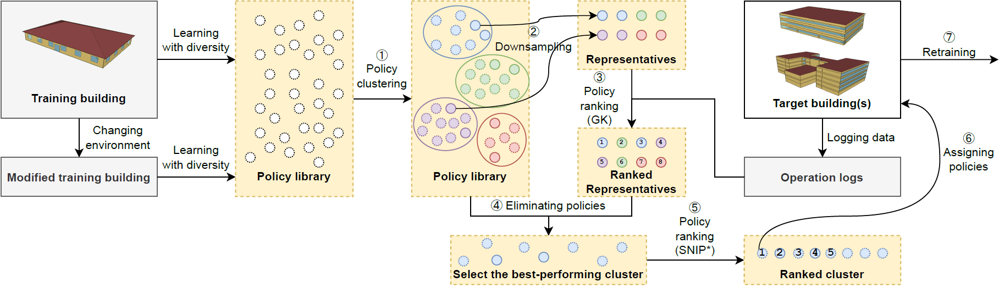

# Mitigating an Adoption Barrier of Reinforcement Learning-based Control Strategies in Buildings

This repository contains the code for [Mitigating an Adoption Barrier of Reinforcement Learning-based Control Strategies in Buildings](#). Please cite our paper if you find this work helpful:
```
Aakash Krishna GS, Tianyu Zhang, Omid Ardakanian, and Matthew E. Taylor, "Mitigating an Adoption Barrier of Reinforcement Learning-based Control Strategies in Buildings", under review.
```
```Bibtex
@article{KRISHNAGS2023112878,
  title = {Mitigating an adoption barrier of reinforcement learning-based control strategies in buildings},
  journal = {Energy and Buildings},
  publisher = {Elsevier},
  volume = {285},
  pages = {112878},
  year = {2023},
  issn = {0378-7788},
  doi = {https://doi.org/10.1016/j.enbuild.2023.112878},
  url = {https://www.sciencedirect.com/science/article/pii/S0378778823001081},
  author = {G.S., Aakash Krishna and Zhang, Tianyu and Ardakanian, Omid and Taylor, Matthew E.},
  keywords = {Multi-agent reinforcement learning, Population diversity, Off-policy policy evaluation, Sim-to-real transfer}
}
```

## Description
This paper explores the possibility of transferring RL-based control of building HVAC system across different buildings in January (heating season). The RL-based controllers are trained on a 5-zone building using policy and environment diversity, and then transferred to two simulated 3-story 15-zone buildings with different climate and a real 26-zone building. The buildings are simulated in the [EnergyPlus](https://energyplus.net/) 9.3.0 environment and is controlled via the [COmprehensive Building Simulator (COBS)](https://github.com/sustainable-computing/COBS) which interacts with EnergyPlus. COBS is used in this work to programmatically execute rule-based control scenarios and to train the RL agents.



This repository is licensed under [MIT](https://github.com/sustainable-computing/COBS-joint-control/blob/master/LICENSE). 
Code is written by [Tianyu Zhang](https://github.com/skyu0221) and [Aakash Krishna GS](https://github.com/AakashSasikumar).

## Contributing
We welcome contributions to this work in different forms, such as bug reports, pull requests, etc.

## Prerequisites
Make sure to have [EnergyPlus](https://energyplus.net/) 9.3.0 installed on your computer. The code is not compatible with other version of EnergyPlus. Download the [COBS](https://github.com/sustainable-computing/COBS) simulator and add its path to your python environment to run the code correctly.

## Dependencies

| Packages     | Version |
|--------------|:-------:| 
| pandas       |  1.1.5  |
| numpy        | 1.19.4  |
| matplotlib   |  3.3.3  |
| torch        |  1.7.1  |
| eppy         | 0.5.53  |
| scikit-learn |  1.0.1  |
| scipy        |  1.5.2  |
| tqdm         | 4.54.0  |

## Usage
If you have a GPU server using `Slurm` job scheduler, then you can execute bash scripts and python codes in the following order. If you do not use `Slurm`, please open the bash file and learn about the command.
1. Train optimal policies and diverse policies with policy diversity and environment diversity to form the basic policy library using the training building.
```bash
./run_1_train_pi_optimal.sh
./run_1_train_with_policy_diversity.sh
```
2. Put all policies together in one folder.
```bash
python3 2-create_policy_library.py
```
3. Generate actions for policies in the library in sampled training states and target buildings' initial state to cluster policies later on.
```bash
./run_3_prepare_cluster.sh
```
4. Evaluate all policies from the library in each target buildings to find baselines.
```bash
./run_4_policies_performance_on_new_building.sh
```
5. Get OPE/ZCP scores using the code available in the second branch [ope_clean](https://github.com/sustainable-computing/building-MARL/tree/ope_clean).
6. Select policies from the policy library as the initial behavior policy in the target building. Open `5-Find_selected_policies_and_plot_final_result.ipynb` using jupyter notebook and execute the first half.
7. Test baseline results of not using transfer learning at all.
```bash
./run_6_train_from_scratch_on_new_building.sh
```
8. Test our proposed pipeline and othe baselines.
```bash
./run_7_train_with_selected_policies.sh
```
9. Plot the result using the `5-Find_selected_policies_and_plot_final_result.ipynb` second half.
